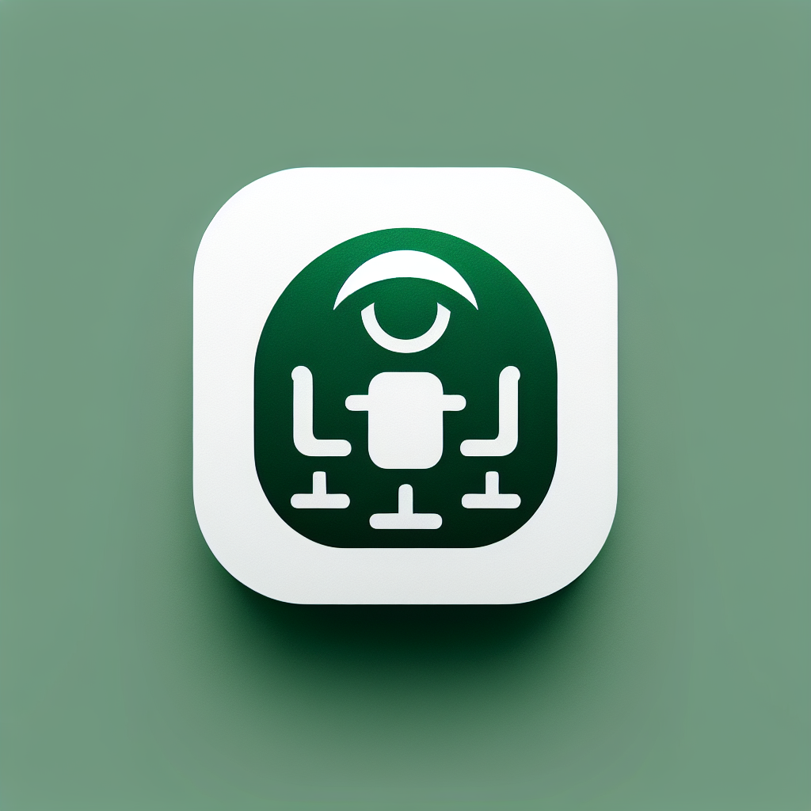
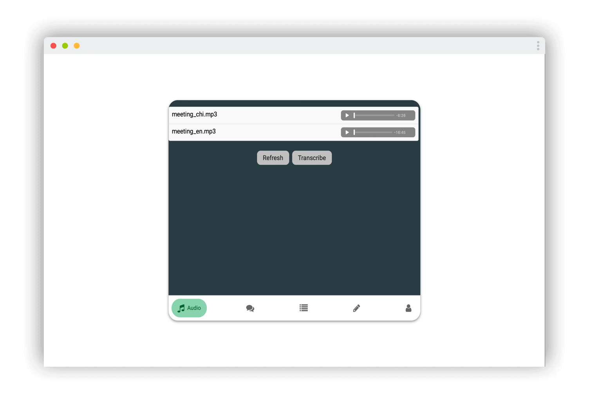
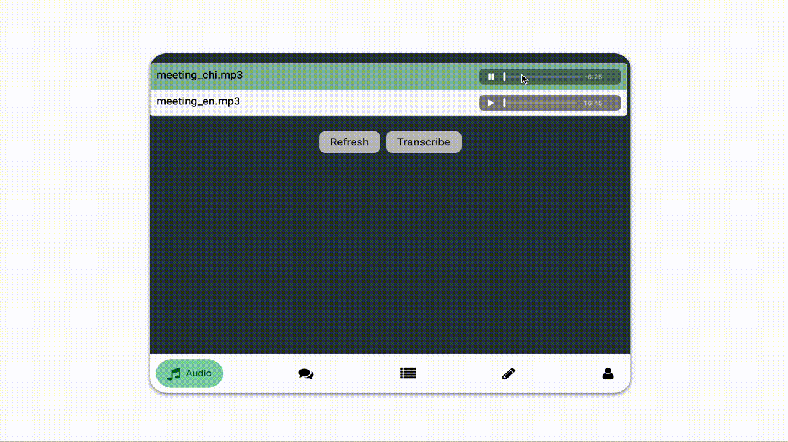

<!-- HEADER -->
<a id="readme-top"></a>

<br />
<div align="center">
  <a href="https://github.com/vinc1am/meeting-ai-pod">
    
  </a>

  <h3 align="center">Meeting AI Pod</h3>

  <p align="center">
    Mini AI Pod to quickly transcribe and analyse the meeting audio
    <br />
  </p>

  [![MIT License][license-shield]][license-url]
  [![Website][website-shield]][website-url]

</div>

<details>
  <summary>Table of Contents</summary>
  <ol>
    <li><a href="#about-the-project">Overview</a></li>
    <li><a href="#getting-started">Installation</a></li>
    <li><a href="#usage">Usage</a></li>
    <li><a href="#roadmap">Roadmap</a></li>
    <li><a href="#license">License</a></li>
  </ol>
</details>


<!-- Overview -->
## Overview



Meeting AI Pod is a simple application to demonstrate the usage of Azure Speech Recognition Service and OpenAI to transcribe and analyze meeting audio into a transcript, summary, and meeting minutes. It also supports the Q&A feature on the meeting transcript.

**Key Features Include:**

* **Speech Recognition** to transcribe the audio into a transcript
* Use **Azure OpenAI GPT** to summarize the transcript into a meeting summary and minutes
* **Q&A Assistant** to answer additional inquiries related to the meeting

For simple demonstration purposes, the application only processes audio stored on GitHub. A better practice is to upload the audio to the cloud, such as Azure Blob Storage.

To get started with the application, execute `sh run.sh`.


<!-- GETTING STARTED -->
## Getting Started

Here are the instructions on setting up the project locally. To get a local copy up and running, please follow these steps:

### Installation

1. Clone the repo
   ```sh
   git clone https://github.com/vinc1am/meeting-ai-pod.git
   ```
2. Rename .env.template as .env. Fill in the parameters
   ```sh
    OPENAI_MODEL_ENGINE=
    OPENAI_API_TYPE=
    OPENAI_API_BASE=
    OPENAI_API_VERSION=
    OPENAI_API_KEY=
    SPEECH_SERVICE_SUBSCRIPTION_KEY=
    SPEECH_SERVICE_REGION=
   ```
3. Run the script to install the necessary packages
   ```sh
   sh run.sh
   ```


<!-- USAGE EXAMPLES -->
## Usage



### Transcribe and Analyse the Audio
Transcribe the audio using Azure Speech Recognition. Then, use Azure OpenAI GPT to summarize the transcript into a meeting summary and minutes.

### Q&A Assistant
An assistant to answer questions related to the transcribed audio.


<!-- ROADMAP -->
## Roadmap

- [x] Transcribe audio with Azure Speech Recognition
- [x] Prompts to summarise the transcript
- [x] Q&A Assistant
- [x] User Interface


<!-- LICENSE -->
## License

Distributed under the MIT License. See `LICENSE.txt` for more information.


<p align="right" style="font-family:verdana;font-size:80%;color:blue"><b><a href="#readme-top" >Back to Top</a></b></p>


<!-- MARKDOWN LINKS & IMAGES -->
[license-shield]: https://img.shields.io/badge/License-MIT-yellow.svg
[license-url]: https://opensource.org/licenses/MIT
[website-shield]: https://img.shields.io/badge/Website-blue.svg
[website-url]: https://www.vinc1am.com/gallery.html#featured
[linkedin-shield]: https://img.shields.io/badge/LinkedIn-blue.svg
[linkedin-url]: https://www.linkedin.com/in/vinc1am/

